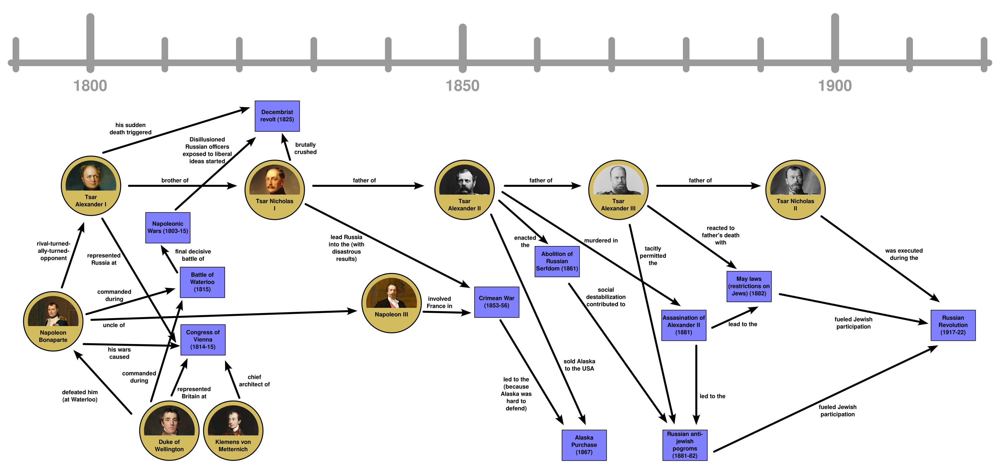

# Ultimate History

The aim of this project is collaborating in the creation of high quality, free and open source Anki decks on the topic of human history.

[Anki](https://apps.ankiweb.net/) is open-source [spaced repetition](https://en.wikipedia.org/wiki/Spaced_repetition) software available for Windows, macOS, Linux, Android and iOS. Check the [installations instructions](https://apps.ankiweb.net/#downloads). Spaced repetition is an improvement over classic _flashcards_ that allows for more flexible and efficient learning.

The underlying idea of this project is to view history as a **graph of events and people** who are connected. The Anki cards not only query you about individual events and people but also about the **relationships** between them. Thus testing your understanding of who was involved in which events, how historical figures influenced each other, and how events are causally linked. This approach helps build a deeper, more interconnected understanding of history.

<a href="docs/imgs/history-as-graph.png"></a>

## Screenshots

<div class="grid" markdown>
    
    
    
    
</div>

[View all screenshots](docs/screenshots.md)

## Installation

See [docs/installation.md](docs/installation.md) for instructions on how to install and update the deck.

## Learning with this Deck

See [docs/learning.md](docs/learning.md) for recommendations on how to study effectively with this deck.

## Contributing

Want to add historical figures, events, or improve existing cards? See [docs/CONTRIBUTING.md](docs/CONTRIBUTING.md) for details on how to contribute.

## Changelog

See [CHANGELOG.md](CHANGELOG.md) for a detailed history of changes to this project.

## Development

This project uses [brain-brew](https://github.com/ohare93/brain-brew) to bidirectionally convert between CrowdAnki JSON format and CSV files. The CrowdAnki files can be found in the `build/` directory. The CSV files under `src/data/` and the note types and templates under `src/note_models/`.

```bash
# Import/export between source files (CSV) and Anki (CrowdAnki JSON format)
uv run main.py source-to-anki
uv run main.py anki-to-source

# Verify and fix data
uv run main.py validate
uv run main.py validate --auto-fix

# List notes by relationship count to identify highly-connected or isolated notes
uv run main.py list-relationships
uv run main.py list-relationships --sort asc --limit 10  # Show least connected
uv run main.py list-relationships --search "Napoleon"   # Filter by search term
```

## Inspiration & Credits

The note templates, the name and the general idea of collaboratively editing
high quality Anki decks are based on [Ultimate
Geography](https://github.com/anki-geo/ultimate-geography).

## License

This project uses a dual licensing approach:

- **Code** (Python scripts, templates, build tools): [MIT License](LICENSE-CODE)
- **Content** (historical data, text, card content): [CC BY-SA 4.0](LICENSE-CONTENT)

Third-party content such as images whose source is indicated on the Anki notes is not covered by these licenses and remains subject to its original copyright and licensing terms.
