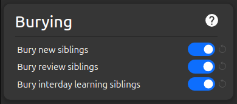
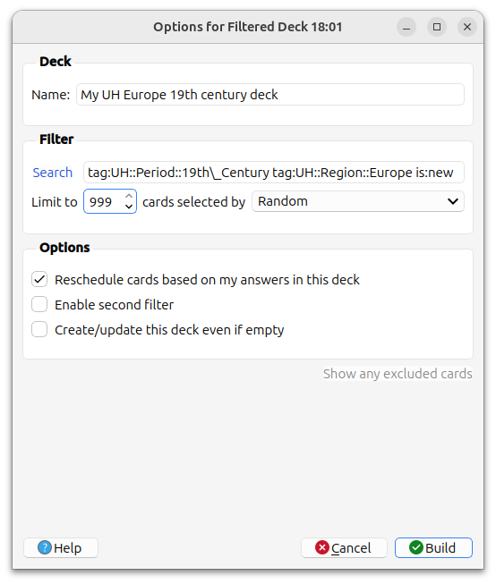

# Learning Recommendations

## Modifications

**DO NOT MODIFY** the content of the cards if you want to update the decks with improvements by the Ultimate History maintainers. The only exception is if you use the `CrowdAnki` plugin AND you only modify the personal fields. See the [installation and update](./installation.md) instructions for details.

If you have improvements for the decks please contribute them as described in the [contribution documentation](./CONTRIBUTING.md).

What you CAN do is adding new cards (notes) using the existing UH note types, even keeping them in the same deck.

## Settings

It is strongly recommended that you enable **Burying** in the deck options. Otherwise the initial learning is too easy because you remember too much from a sibling card. A few weeks later you are then more likely to fail those cards.

## Rating Cards

### Focus on the Main Question
Each card asks one specific thing, even though the back may show additional context information. Only mark a card incorrect if you get that **one specific thing** wrong—the extra context is there to help you build connections, not to test you.

For example when the card asks what a person is **known for**, it does **NOT** matter whether you remember their birth and death date.

    
    

### Related Events and People
When a card asks about related events or people, you only need to name **one** correct example, not all of them. The goal is to build connections between concepts, not memorize exhaustive lists.

For example:

    
    

### Date Precision
Decide your precision level **before** reviewing and be consistent:
- **Exact dates** (e.g., 1776)
- **Decade** (e.g., 1770s)
- **Half-century** (e.g., late 18th century)

Rate your answers according to your chosen precision level. Be honest with yourself—consistency matters more than perfection.

## Study Strategy

### Use Filtered Decks
Create filtered decks by **region and period** to:
- Build strong mental networks between related events
- Understand regional context and connections
- Develop a coherent narrative within each time period

For example to learn only new cards for Europe in the 19th century: `tag:UH::Period::19th\_Century tag:UH::Region::Europe is:new`

Read more about filtered decks in the [Anki documentation](https://docs.ankiweb.net/filtered-decks.html).

### Transition to Mixed Review
Once cards enter regular review (after initial learning), it's fine to mix all cards together. By then, you'll have built the foundational connections through your filtered deck study.
