# Card Examples

## Person Cards

### Person: Picture to Name

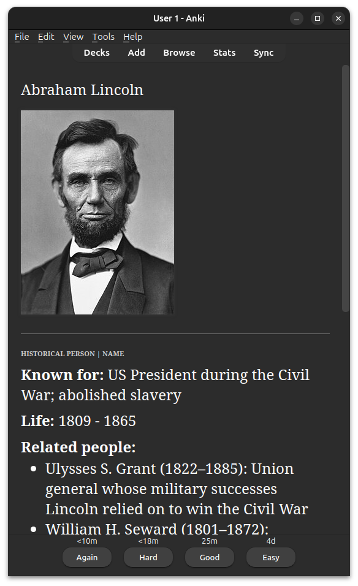

### Person: Name to Known For

### Person: Known For to Name

### Person: Life
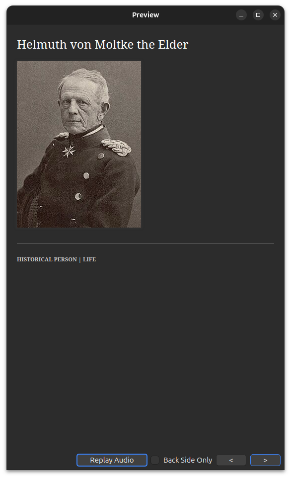
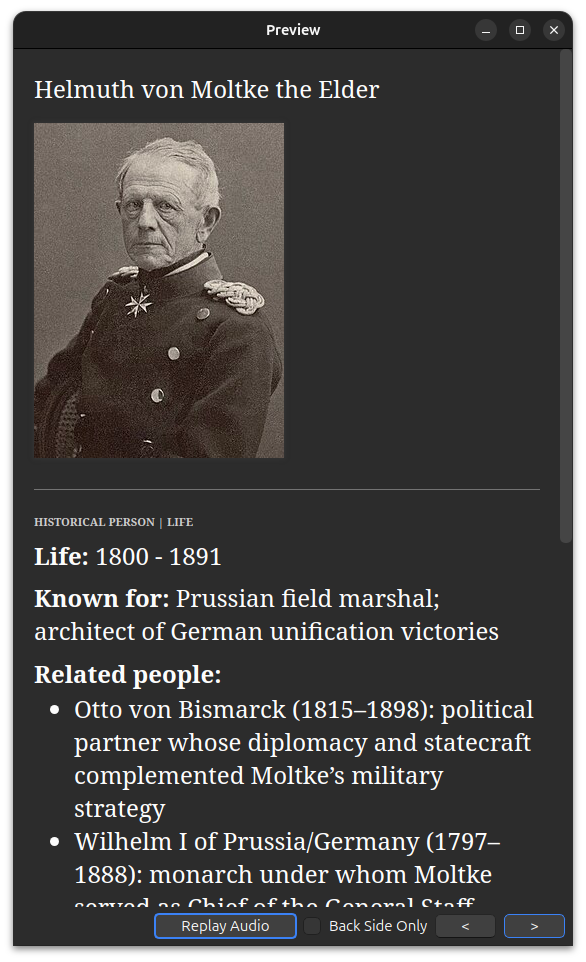

### Person: Related Person
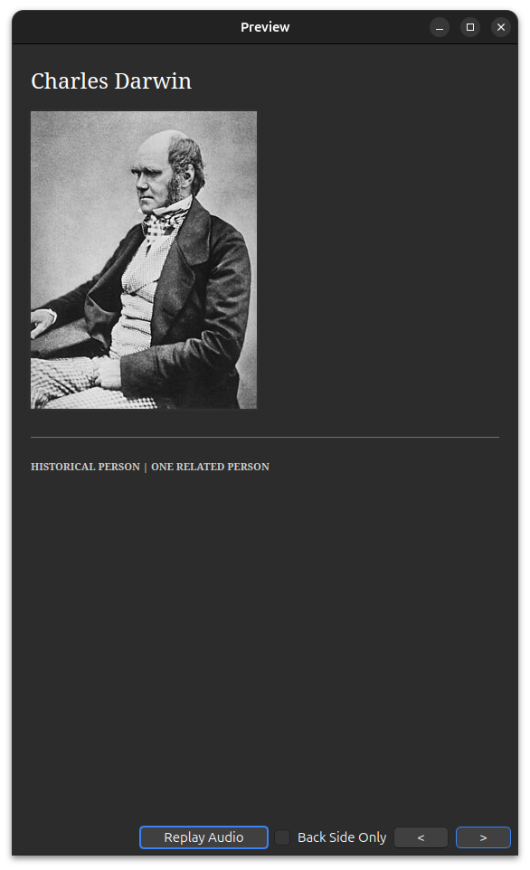
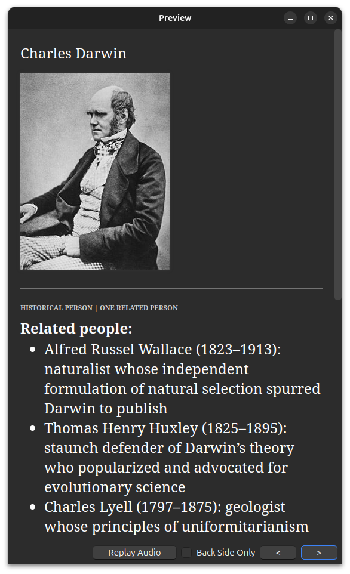

### Person: Related Event
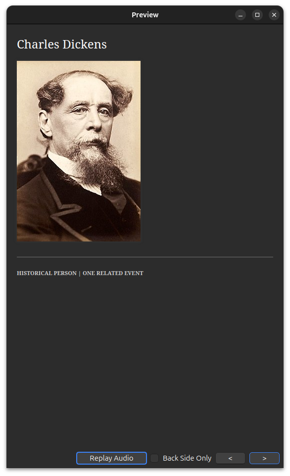

## Event Cards

### Event: Name to Summary

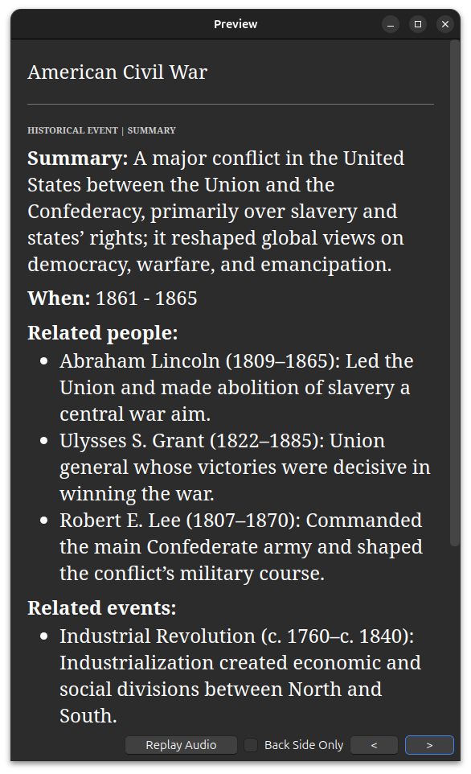

### Event: Summary to Name
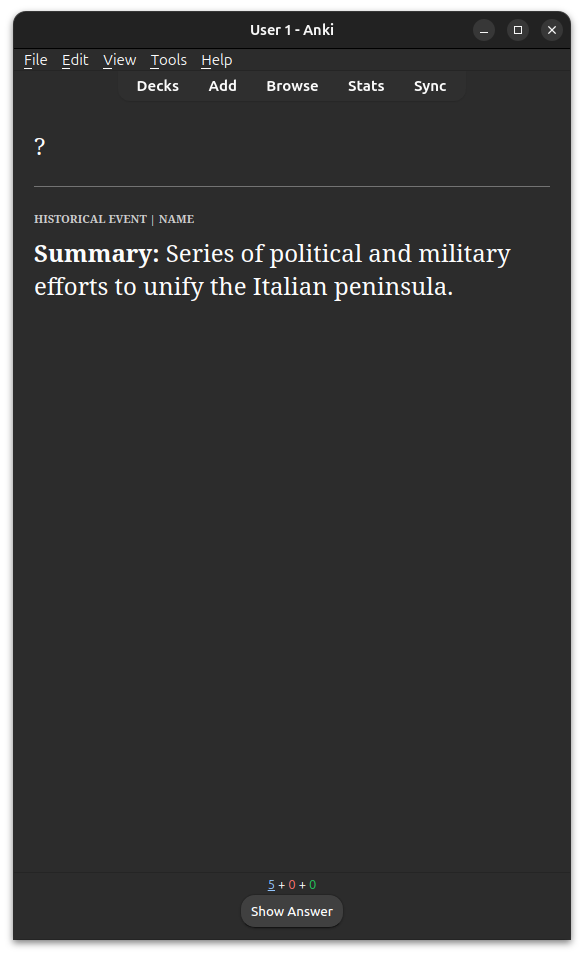
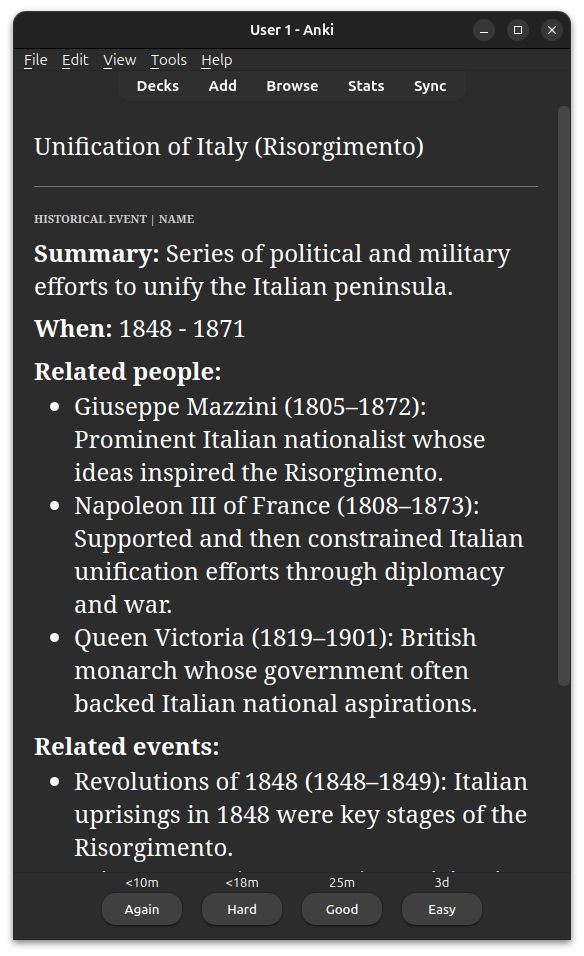

### Event: When

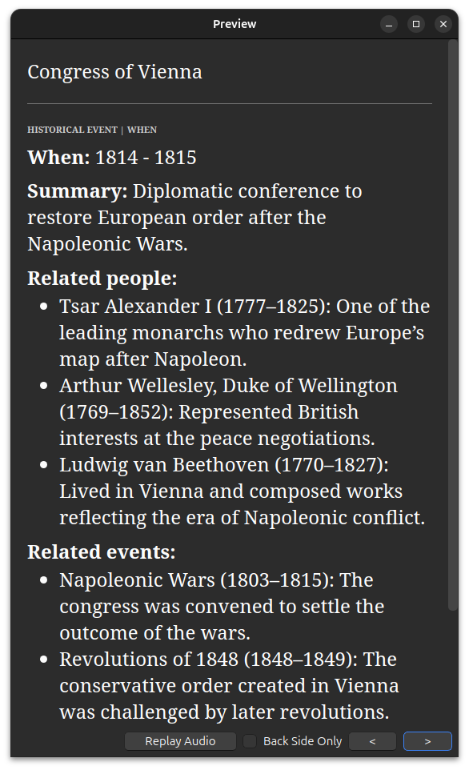

### Event: Related Person
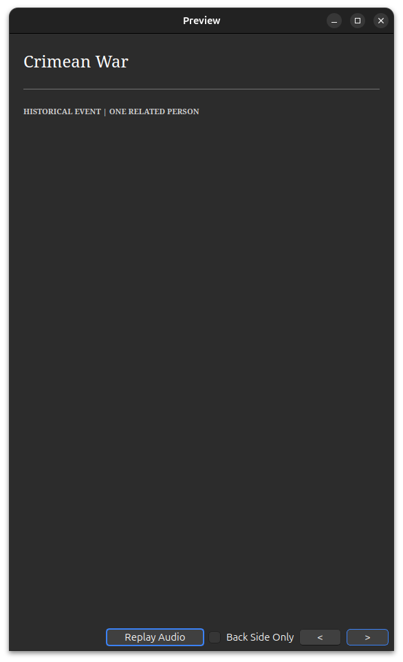
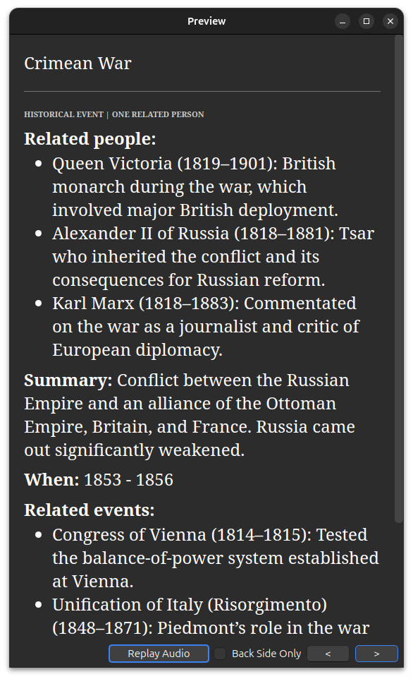

### Event: Related Event
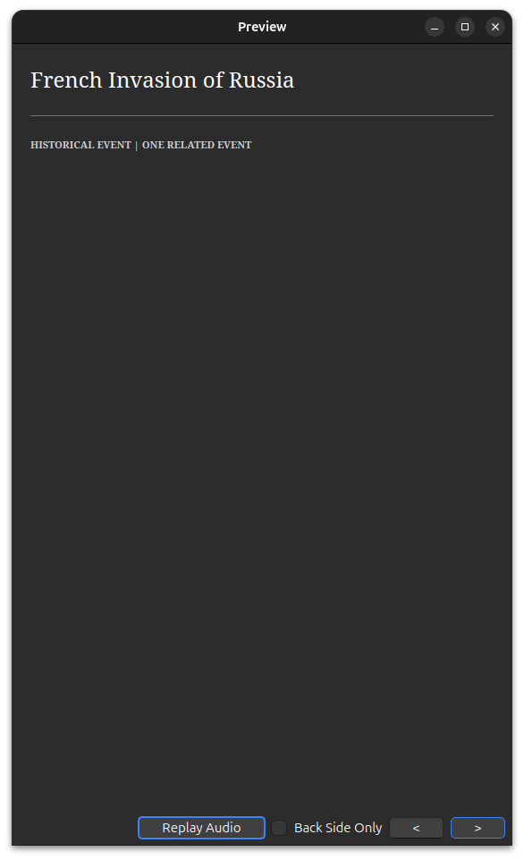
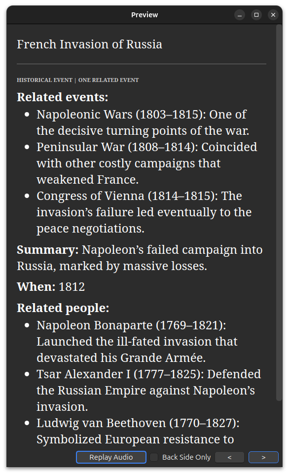

## Other Card Types

### Q&A

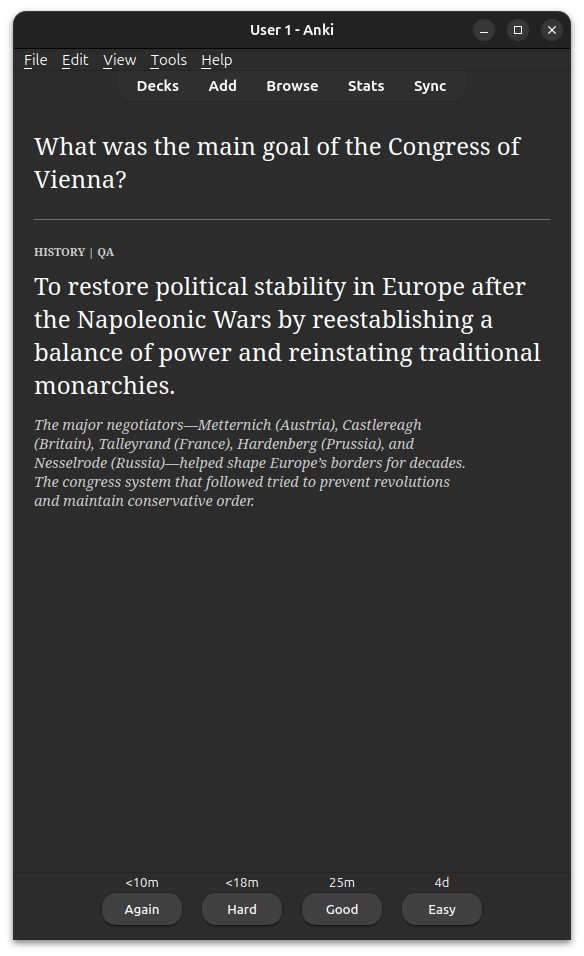

### Cloze
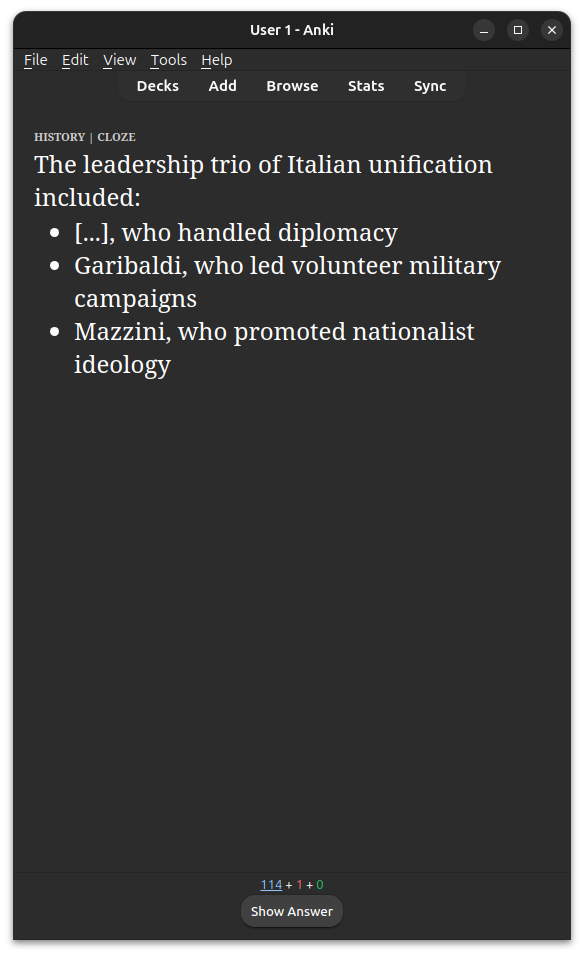
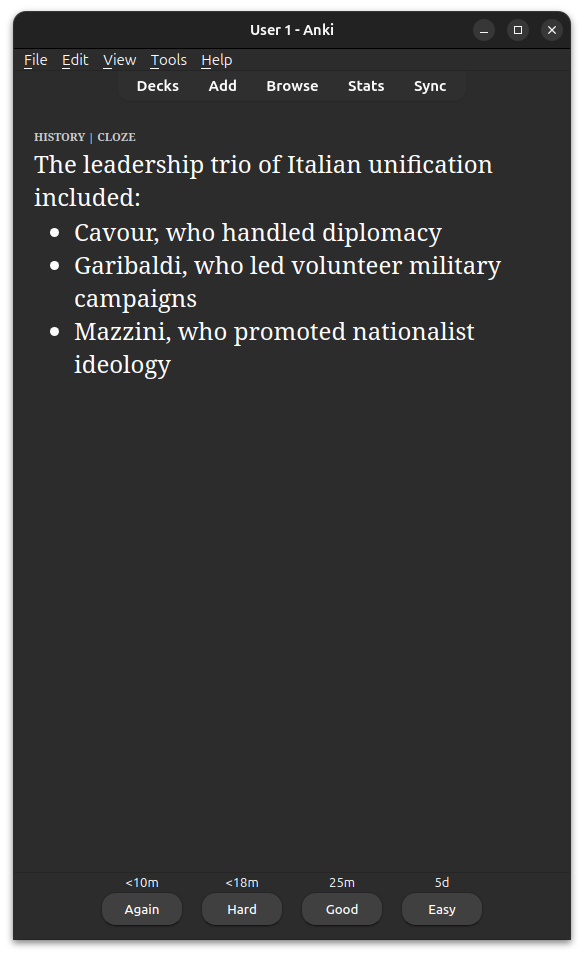
